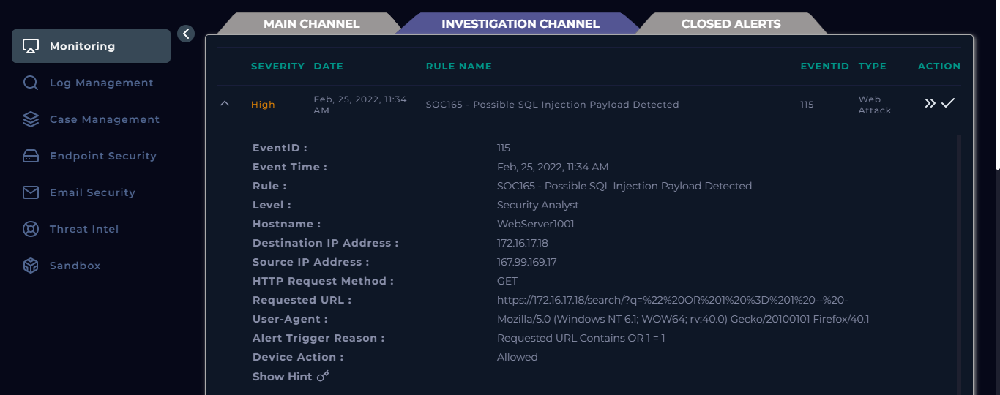
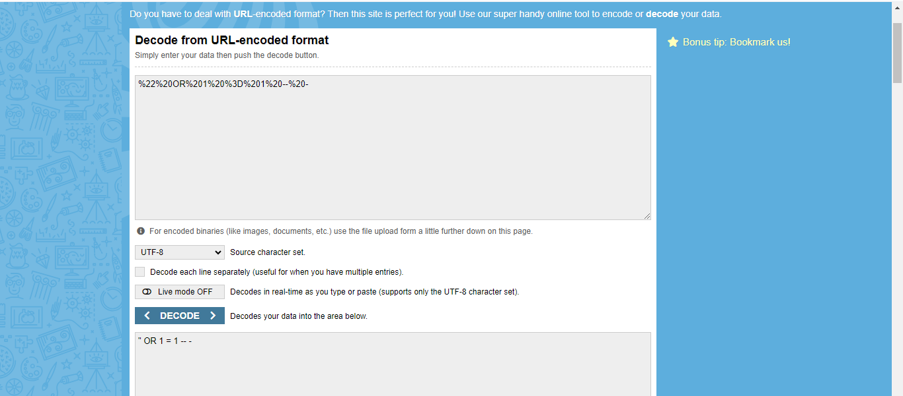
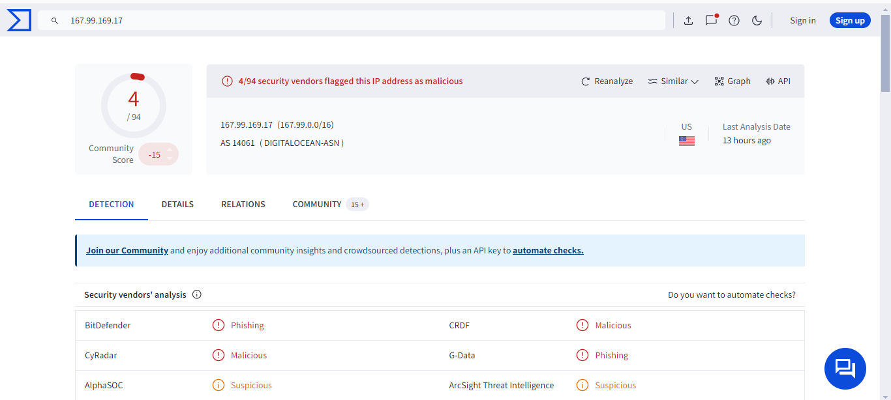
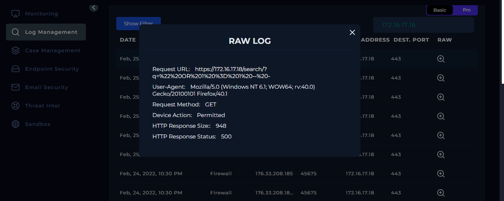
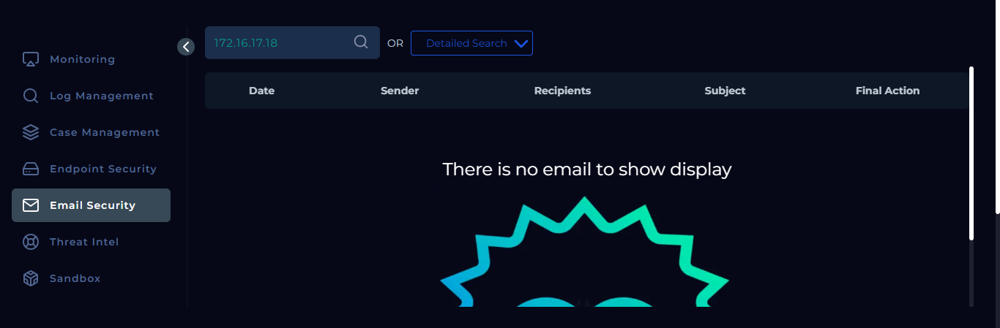

# SOC165 - Possible SQL Injection Payload Detected
## LETSDEFEND.IO SIEM

## Event Details
**EventID:** 115  
**Event Time:** Feb 25, 2022, 11:34 AM  
**Rule:** SOC165 - Possible SQL Injection Payload Detected  
**Level:** Security Analyst  
**Hostname:** WebServer1001  
**Destination IP Address:** 172.16.17.18  
**Source IP Address:** 167.99.169.17  
**HTTP Request Method:** GET  
**Requested URL:** https://172.16.17.18/search/?q=%22%20OR%201%20%3D%201%20--%20-  
**User-Agent:** Mozilla/5.0 (Windows NT 6.1; WOW64; rv:40.0) Gecko/20100101 Firefox/40.1  
**Alert Trigger Reason:** Requested URL Contains OR 1 = 1  
**Device Action:** Allowed  

## Summary
I identified a possible SQL injection attack attempt through the requested URL, which was decoded to reveal a classic SQL Injection payload (`" OR 1 = 1 -- -`). The attack originated from IP address `167.99.169.17`, flagged as malicious in VirusTotal. The HTTP response status was `500`, indicating that the attack was unsuccessful.

## Artifacts
| Type          | Value                            | Comment                                   |
|---------------|----------------------------------|-------------------------------------------|
| URL           | https://172.16.17.18/search/?q=%22%20OR%201%20%3D%201%20--%20- | Potential SQL injection payload attempt   |
| Decoded URL   | " OR 1 = 1 -- -                  | SQL Injection payload attempt             |
| IP Address    | 167.99.169.17                    | Flagged as malicious in VirusTotal        |
| HTTP Response | 500                              | Indicates server error; attack failed     |

## Analysis Notes
- I decoded the requested URL to confirm the presence of SQL injection.  
- Log Management showed multiple requests from the source IP, all relating to the SQL injection vulnerability.
- All requests had the same response size and a `500` HTTP response status, showing the attack was unsuccessful.
- There was no email related to the destination IP, confirming this was not a planned test.

## Close Alert Note
The SQL Injection attempt was identified through URL decoding and log analysis. The attack was unsuccessful as all requests resulted in `500` response statuses, showing no successful data extraction. The source IP is flagged as malicious in VirusTotal, reinforcing the threat.

## Screenshots
1. **Alert Summary**  
   

2. **Decoded URL**  
   

3. **Malicious Source IP (VirusTotal)**  
   

4. **Log Management - Raw Log**  
   

5. **No Related Email to Destination IP**  
   

## Conclusion
This repository demonstrates the analysis of a SQL injection attempt detected in the SIEM. The event was a true positive, but the attack was ultimately unsuccessful.
